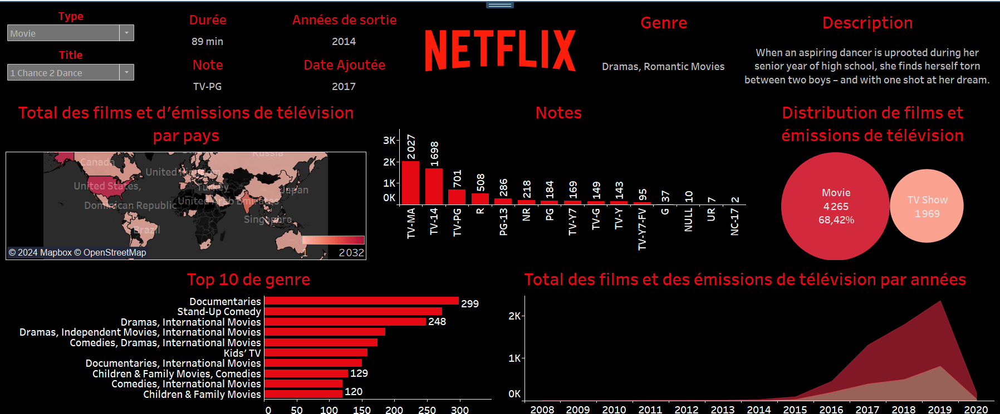

# Tableau de bord d'analyse du contenu Netflix 🎥📊


## Description
Ce projet fait partie de mon **Challenge de Tableau de bord** où je crée un nouveau tableau de bord tous les deux jours. Dans ce projet, j'ai analysé les données des contenus **Netflix** pour explorer les tendances des films et séries télévisées à travers différents genres, pays et années. Le tableau de bord a été réalisé avec **Tableau Desktop**.

L'analyse se concentre sur les points suivants :
- La répartition des films et des séries par **pays**.
- Les **genres les plus populaires** et leur classement.
- La distribution des contenus selon les **notes/évaluations** Netflix.
- Le nombre total de films et de séries sortis par **année**.
- Une vue détaillée de chaque film ou série avec des informations telles que le titre, l'année de sortie, la note et une description.

## Aperçu du Tableau de bord

 

## Tableau de bord
Vous pouvez consulter le tableau de bord interactif sur **Tableau Public** en suivant ce lien :  
[Tableau de bord Netflix](https://public.tableau.com/shared/XMST9F5YP?:display_count=n&:origin=viz_share_link)

## Données
Les données utilisées pour ce projet proviennent de plusieurs sources, notamment des bases de données publiques sur les contenus Netflix. Vous pouvez trouver les données brutes ainsi que toutes les instructions pour reproduire ce projet sur le dépôt GitHub.

## Fonctionnalités
- **Filtrage interactif** : Sélectionner un genre ou un type de contenu (film ou série) pour voir les données spécifiques.
- **Visualisation par carte** : Voir la répartition des films et séries par pays.
- **Classement des genres** : Visualiser le top 10 des genres les plus populaires sur Netflix.
- **Chronologie des sorties** : Suivre l'évolution du nombre de sorties de films et de séries au fil des ans.

## Technologies utilisées
- **Tableau Desktop** pour la création du tableau de bord.
- **GitHub** pour le partage du code et des données.
  
## Installation
1. Clonez ce dépôt GitHub :  
   ```bash
   git clone https://github.com/votre-utilisateur/votre-repo.git

2. Ouvrez les fichiers dans Tableau Desktop pour explorer et modifier les visualisations.

## Contributions
Les contributions sont les bienvenues. Si vous souhaitez ajouter des fonctionnalités, n'hésitez pas à soumettre une Pull Request ou à ouvrir une Issue pour discuter des améliorations.

# Réaliser par 

TSIKA Helicia 


Si tu as besoin d'aide pour héberger ou ajouter l'image, fais-le moi savoir ! Pour toute question ou suggestion, vous pouvez me contacter via mon profil GitHub.
